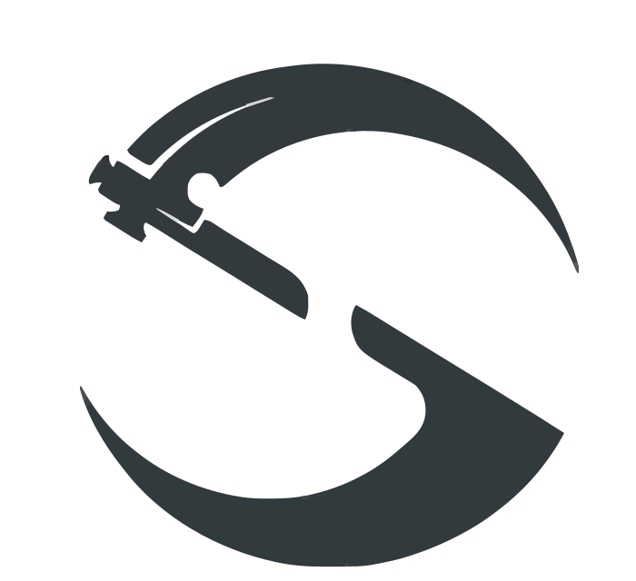

<p align="center">
  <picture>
    <source media="(prefers-color-scheme: dark)" srcset="logo-dark.svg">
    <source media="(prefers-color-scheme: light)" srcset="logo.svg">
    
  </picture>
</p>

<h1 align="center" style="margin-bottom: 0;">SolReapr</h1>
<p align="center" style="margin-top: -12px;">
  A semantic analyzer and language server for Solidity, built in Rust.
</p>

<p align="center">
  A Rust-Analyzer-like language server for Solidity. Very early development stage.<br />
  Best of both worlds: Incremental reparsing + incremental recomputation leveraging tree-sitter + salsa.
</p>

---

## Getting Started

To run:

```bash
cd lsp_server
cargo build
cd ../extension
npm install
npm run compile
```

Then open the project (`extension/src/extension.ts`) in VS Code and press `F5` to start the extension in debug mode.

## Capabilities

- Hover 👍
- Goto definition 👍